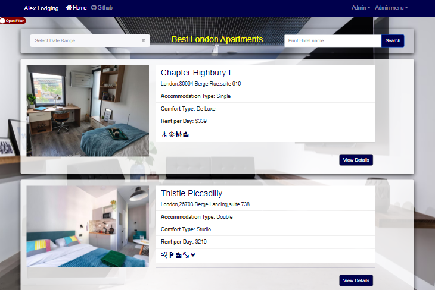
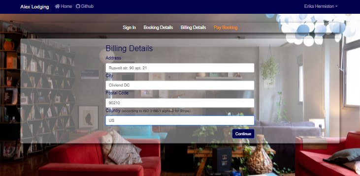

# Accommodation booking application built with MERN stack

An example of a complex application with React, Redux, Express and MongoDB

## Getting Started
These instructions will provide you with a copy of the project that will be launched on your local computer for development and testing.

## Prerequisites
What things you need to install the software.

- Git
- NPM
- local MongoDB database
- Robo 3T (or another MongoDB management tool)
- IDE (or code editor)

#### The application is under development...

